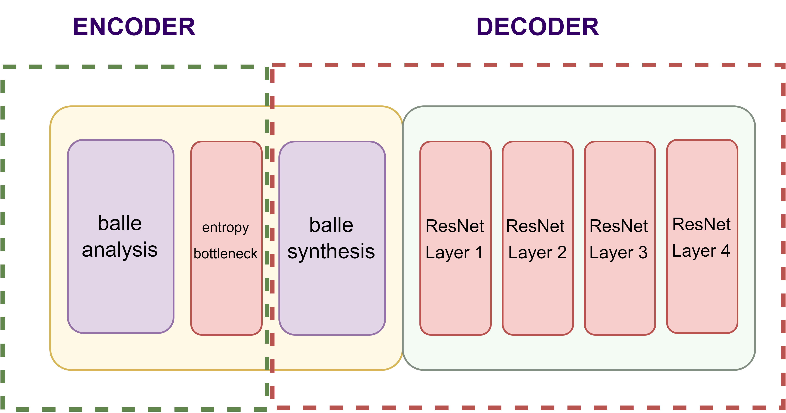
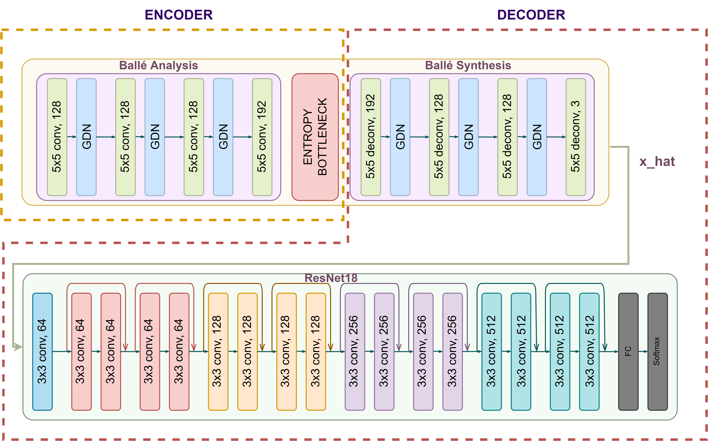

# Task-Based-Compression

  

We compared our model with separately trained Balle and ResNet model results. For the final project, we will also compare our model with JPEG. To do that, we will compress the input images with the JPEG algorithm and then feed it into the ResNet model. Final results will show us if our Balle fed ResNet model can outperform the JPEG fed ResNet baseline.

  

