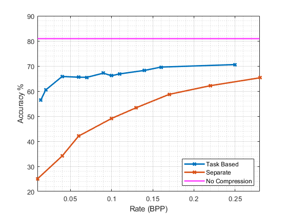

# Task-Based-Compression

In this project we will be looking into a task based compressor, specifically compression for classification. Our focus will be to modify the Ballé compressor and combine it with ResNet classifier to learn a compressor with a distortion measure of cross entropy loss. We will train them together and seperately and compare the two results. The high level block diagram of the project can be seen as follows.

  

## Final Architecture

After combining the Balle compressor and ResNet classifier, the final architecture is as follows:

  

## Results

It can be seen that our task based model outperforms the separate model especially in low BPP regime. This result is also expected since joint optimization should always be atleast as good as separate optimization. It is interesting to see that even with 0.01 bits per pixel we are able to achieve 56\% accuracy. As the rate increases both models get closer to the original ResNet18 performance (magenta line). This magenta line represents an upper bound since there is no compression involved in that case, so no additional loss from compression will occur.

  

## How to Reproduce the Results

- Run the Task_Based_Compression.ipynb notebook with different lambda values (default:1.5). Save the bpp and test_accuracies. Plot the rate distortion curve using them. 
- Run the Spearate_Training.ipynb notebook with different lambda values to derive the RD curves. 
- Compare the two.
